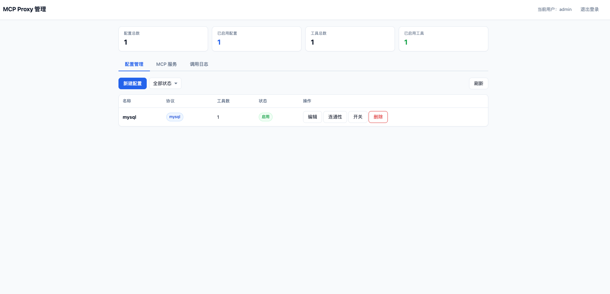
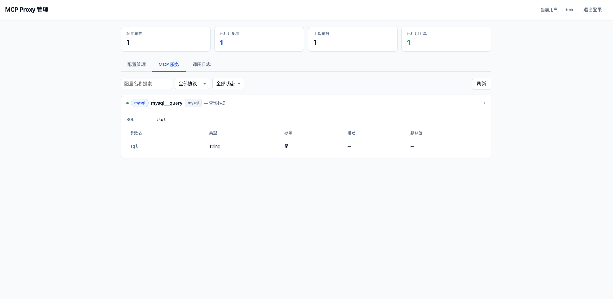
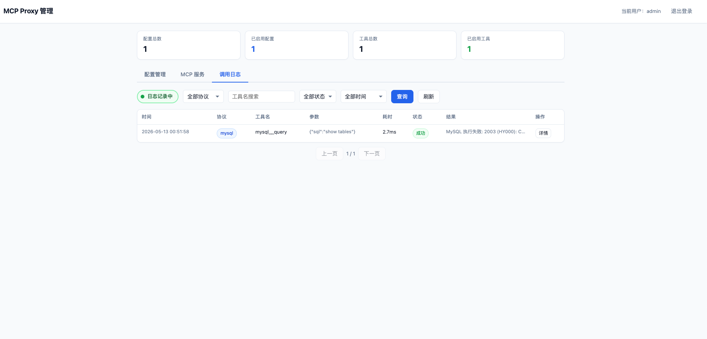

# local-mcp-proxy

一个基于 [FastMCP](https://github.com/jlowin/fastmcp) 的本地 MCP 代理服务，用于统一转发 MySQL/HTTP/文件系统数据源的工具调用。

## 特性

- 通过配置动态注册 MCP 工具，无需编写代码
- 支持 MySQL 只读查询（SELECT/SHOW/DESCRIBE/EXPLAIN）
- 支持 HTTP API 请求转发
- 支持文件系统操作（读取文件、列举目录）
- 提供 Web 管理界面，可视化管理工具配置
- 支持 streamable-http 和 stdio 两种传输模式
- 配置热重载，已连接客户端自动同步工具列表

## 界面预览








## 下载安装

从 [Releases](https://github.com/lahmXu/local-mcp-proxy/releases) 页面下载对应平台的安装包：

### macOS .pkg 安装包（推荐）

下载 `.pkg` 文件，双击安装即可。安装后可在启动台或菜单栏中找到 Local MCP Proxy。

### ZIP 压缩包（便携版）

解压后进入目录：

```bash
unzip dist-v0.0.2-darwin-arm64.zip
cd dist-v0.0.2-darwin-arm64
chmod +x local-mcp-proxy start.sh stop.sh
```

目录结构：

```
dist-v0.0.2-darwin-arm64/
├── local-mcp-proxy        # 可执行文件
├── start.sh               # 启动脚本
├── stop.sh                # 停止脚本
├── configs/
│   └── mcp_configs.json   # 配置文件（首次启动自动生成）
└── logs/
    └── server.log         # 日志（启动后自动生成）
```

## 启动服务

```bash
# 默认启动（streamable-http 模式，端口 9210）
./start.sh

# 指定端口
./start.sh --port 9212

# stdio 模式（供 Cursor/Claude Code 等客户端直接连接）
./start.sh --stdio
```

启动成功后会显示：

```
==================================================
  MCP 地址:   http://127.0.0.1:9210/mcp
  配置页面:   http://127.0.0.1:9211
  配置文件:   /path/to/configs/
  日志文件:   /path/to/logs/server.log
==================================================
```

## 停止服务

```bash
./stop.sh
```

## MCP 客户端配置

### Claude Code

```bash
# streamable-http 模式
claude mcp add --transport http local-mcp-proxy http://127.0.0.1:9210/mcp

# 全局添加（所有项目可用）
claude mcp add --scope user --transport http local-mcp-proxy http://127.0.0.1:9210/mcp
```

### Cursor / Claude Desktop（streamable-http）

```json
{
  "mcpServers": {
    "local-mcp-proxy": {
      "url": "http://localhost:9210/mcp"
    }
  }
}
```

## Web 管理界面

启动服务后访问 http://127.0.0.1:9211，在界面上配置 MySQL/HTTP 数据源和工具定义。

Web 界面提供：
- MCP 配置的增删改查
- 工具定义管理（参数、SQL/HTTP 配置，可折叠卡片式编辑）
- 连接测试（MySQL/HTTP）
- 服务状态监控（支持按配置名/工具名搜索）
- 默认用户名/密码: admin/admin123

## 命令行参数

### start.sh 参数

| 参数 | 说明 | 默认值 |
|------|------|--------|
| `--stdio` | 使用 stdio 传输模式 | 否（默认 streamable-http） |
| `--host` | MCP 监听地址 | 127.0.0.1 |
| `--port` | MCP 端口 | 9210 |

### local-mcp-proxy 参数

| 参数 | 说明 | 默认值 |
|------|------|--------|
| `--config-dir` | 配置目录路径 | 当前目录下 configs/ |
| `--web-host` | 管理页面监听地址 | 127.0.0.1 |
| `--web-port` | 管理页面端口 | 9211 |
| `--mcp-transport` | MCP 传输模式（stdio / streamable-http） | streamable-http |
| `--mcp-host` | MCP 监听地址 | 127.0.0.1 |
| `--mcp-port` | MCP 端口 | 9210 |
| `--log-level` | 日志级别 | INFO |

## 环境变量

| 变量 | 说明 |
|------|------|
| `MCP_PROXY_CONFIG_DIR` | 配置目录路径（等同于 `--config-dir`） |

## 从源码构建

如需自行构建，参见下方说明。

### 环境要求

- Python 3.10+
- Conda（推荐）

### 运行与打包

```bash
# 创建并激活 Conda 环境
conda create -n mcp python=3.10
conda activate mcp

# 安装依赖
pip install -r requirements.txt

# 直接运行
python main.py

# 打包为可执行文件（生成 dist 目录）
./scripts/build.sh [版本号]

# 生成 macOS .pkg 安装包（依赖上一步的 dist 目录）
./scripts/build_pkg.sh [版本号]
```

### 构建脚本说明

| 脚本 | 用途 |
|------|------|
| `scripts/build.sh` | PyInstaller 打包为单文件可执行程序 |
| `scripts/build_pkg.sh` | 将 dist 目录打包为 macOS .pkg 安装包（含 .app Bundle、菜单栏图标、开机自启） |

## 项目结构

```
├── main.py              # 入口：解析参数，启动 MCP + Web 服务
├── proxy_server.py      # MCP 代理核心：动态注册工具、客户端版本同步
├── adapters.py          # 协议适配器：MySQL / HTTP / 文件系统执行逻辑
├── models.py            # 数据模型：配置定义 + JSON 文件存储 + 运行时元数据
├── config.py            # MySQL 全局配置（从环境变量加载）
├── web_app.py           # Flask Web 管理界面 + REST API
├── web/
│   └── index.html       # 前端单页应用
├── configs/
│   └── mcp_configs.json # 工具配置文件（自动生成）
├── tests/               # 单元测试
├── scripts/
│   ├── build.sh         # PyInstaller 打包脚本
│   ├── build_pkg.sh     # macOS PKG 安装包构建脚本
│   ├── start.sh         # 启动脚本
│   ├── stop.sh          # 停止脚本
│   └── install.sh       # 依赖安装脚本
└── requirements.txt     # Python 依赖
```
